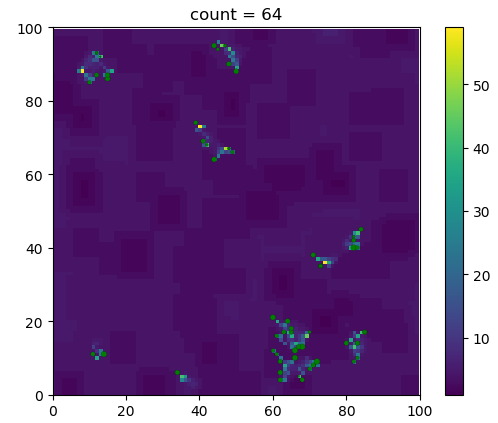
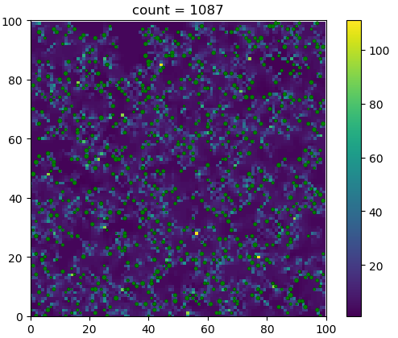

V1: a baseline of Tierra, animated:
- randomly positioned nutrition on the map
- fission 

screenshots:

  
   

some ideas not implemented:
- endowments, a piece of code carried with the cell
- battle and alliance system
- family tree tracking
- Leaderboard and Gini coefficient monitoring
- optimization of code, enhance runtime efficiency 
